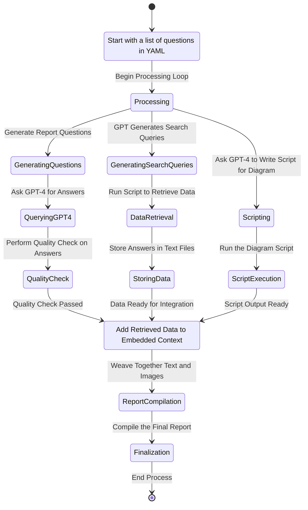
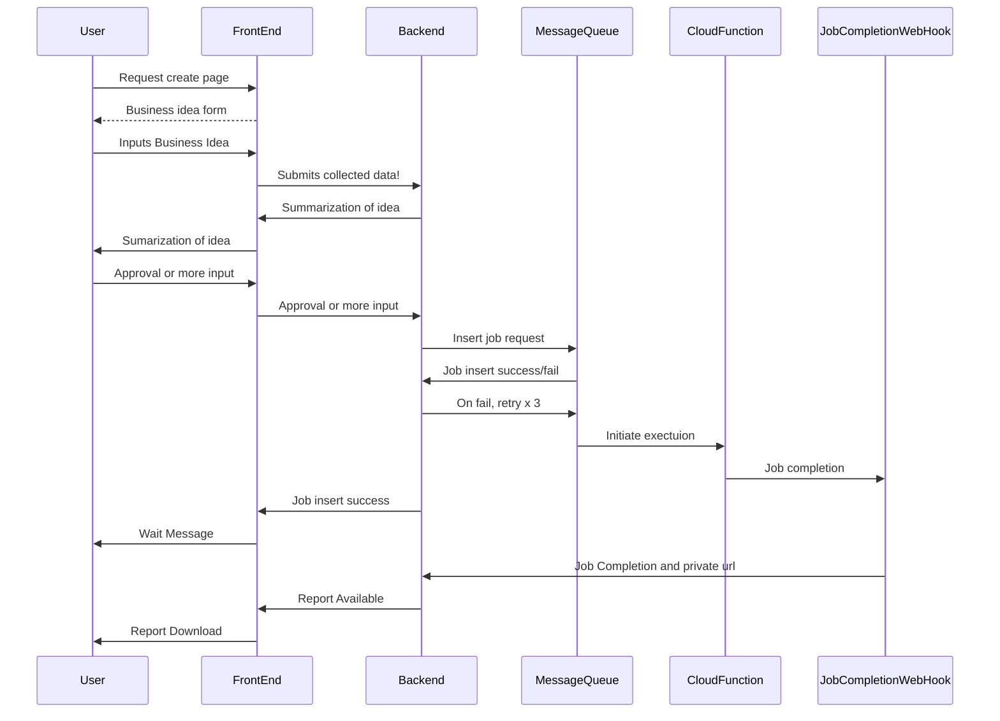

# BVR Project Architectual Revisions

[[toc]]

## The Work

Here we've defined the core work below. We've found we cannot implement this with `autogen` RAG chat alone, as our data doesn't contextualize well in its current design. Additionally the latest module doesn't support the latest enpoints.

So we're abandoning `autogen` for most things. Instead we'll use `embedchain` to do the same work and write structing code to take the place of what `autogen` was doing.

## The process
And so now this is how it'll work:

And so now we code.