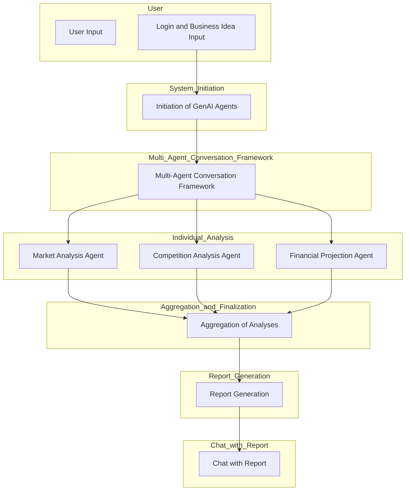
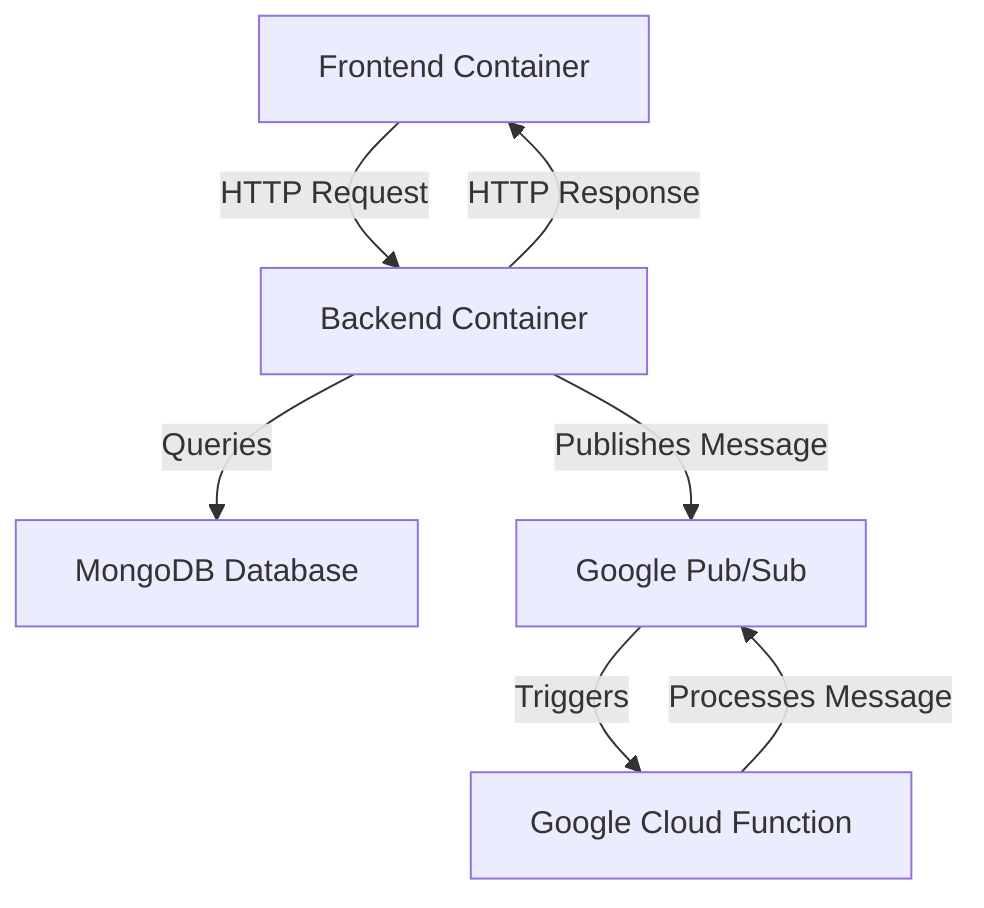
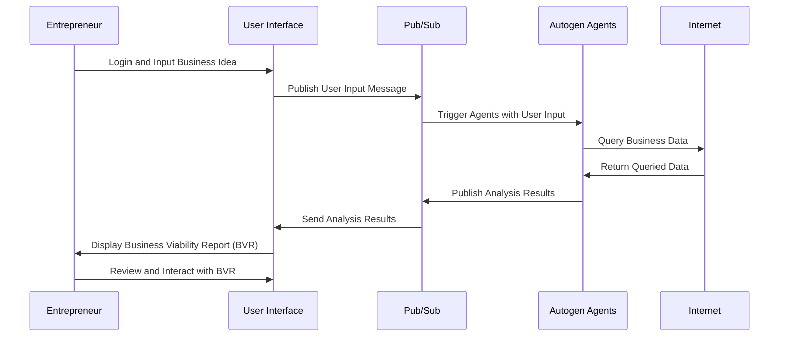
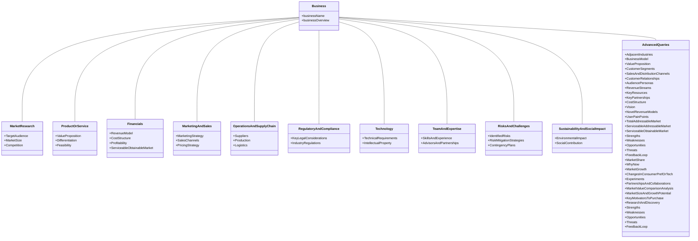
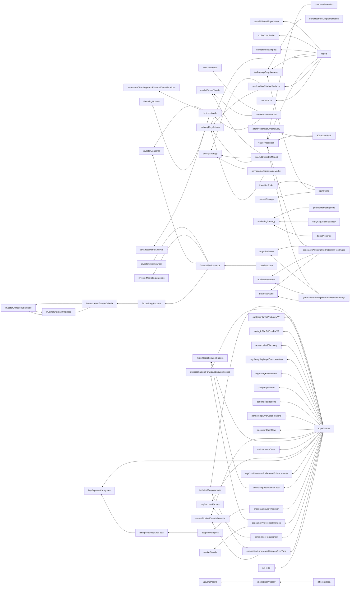

# Designing the BVR Creation Process from Requirements

::: warning WIP
this article is a Work In Progres(WIP). It'll change at my discretion.
:::

- Part I [Specification](./fun-with-gen-ai)
- Part II [Requirements](./enhancing-informed-entrepreneurship-through-generative-ai-powered-bvr.md)

[[toc]]

# Overall Design

This is a loose overall design, as clearly we aren't even specifying stack tech, how logins will work, which db we'll use, etc. Let's just talk about the hard parts.

## Autogen


Microsoft's PyPI autogen module is a Python package that enables the development of next-gen large language model (LLM) applications using multiple agents that can converse with each other to solve tasks. The module is available on PyPI and can be installed using pip.

Here is an example of how you can use the autogen module to initiate a chat between an assistant and a user proxy:
```python
from autogen import AssistantAgent, UserProxyAgent

assistant = AssistantAgent("assistant")
user_proxy = UserProxyAgent("user_proxy")
user_proxy.initiate_chat(assistant, message="Show me the YTD gain of 10 largest technology companies as of today.")
```
This code creates an assistant agent and a user proxy agent, and then initiates a chat between them. The user proxy agent sends a message to the assistant agent, asking for the YTD gain of 10 largest technology companies as of today. The assistant agent processes the message using LLMs and returns the answer to the user proxy agent.

You can find more examples and documentation on the official autogen GitHub page.
## RAProxyAgent

Best most concise information about Autogen with RAProxy:
1. [AutoGen Advanced Tutorial 🧠 Build Insane AI Agents (Bonus: NEW Agent Type!)](https://youtu.be/PUPO2tTyPOo?si=0QN1BrfHGpxjPzxg&t=1280)

<YouTube id="PUPO2tTyPOo" start="1280" />

### RAG Summary

The video above on Retrieval Augmented Generation (RAG) in Autogen discussed the integration of external data sources, typically in the form of embeddings which enriches the capabilities of agents.

The Key points:

1. **Agent Types**:
   - The concept of RAG was introduced to enhance two existing agent types: assistant agent and user proxy agent, leading to new types called retrieve assistant agent and retrieve user proxy agent.
   - These augmented agents can pull information from specified external data sources.

2. **Configuration**:
   - The configuration includes specifying a `retrieve config` parameter, which contains the task type (e.g., QA for question-answering) and a path to the document (e.g., a README file) from which the agent pulls information.
   - The agent processes the document, converting text to embeddings and storing them in a vector database, with customization options available for embeddings and text chunking methods.

3. **Retrieval Example**:
   - An example was provided showing a comparison between responses from a regular user proxy agent and a retrieve user proxy agent when asked about Autogen. The retrieve user proxy agent could access and utilize the external documentation to provide a more accurate answer.

4. **Customization**:
   - Users can customize the embedding function, text split function, and vector database used for retrieval.
   - Different models like OpenAI's or Hugging Face’s models can be used for computing embeddings, and different databases like Chroma DB or Pine Cone can be used for vector storage.

5. **Integration**:
   - The RAG agents can be integrated with other agents in a group chat setting, demonstrating a sophisticated example of how retrieval agents can work in tandem with other agents to handle a conversation and pull in external information when needed.

6. **Advanced Customization**:
   - The platform allows for deep customization, including overriding the default methods for document retrieval and customizing the vector database.

Through RAG, Autogen enables the creation of more knowledgeable agents that can access and utilize external data seamlessly, demonstrating a significant enhancement in the agent's ability to provide accurate and contextually rich responses.

::: info Requirements
RAG meets these requirements
#### Technical
- **embeddings for relevant automatic contexts**
#### Business
- **Ensure the reports are comprehensive, incorporating various data representation formats.**
:::

## The Design

Here’s a simplified workflow using AutoGen in our proposed digital platform:

1. **User Input:**
   - The entrepreneur logs into the platform and inputs their business idea along with any relevant data.

2. **Initiation of GenAI Agents:**
   - The system initiates various GenAI agents, each tailored for different analysis dimensions like market analysis, financial projection, competition analysis, etc.

3. **Multi-Agent Conversation Framework:**
   - The agents communicate and collaborate using AutoGen’s multi-agent conversation framework. For instance:
       - The Market Analysis Agent might need data from the Competition Analysis Agent to complete its analysis.
       - The Financial Projection Agent might need inputs from both Market and Competition Analysis Agents to generate accurate financial forecasts.

4. **Individual Analysis:**
   - Each agent performs its designated analysis and generates a portion of the Business Viability Report (BVR).

5. **Aggregation and Finalization:**
   - AutoGen helps in aggregating the individual analyses into a comprehensive BVR, ensuring that the insights from one agent are correctly integrated with the others.

6. **Report Generation:**
   - The final BVR, containing a multi-faceted evaluation of the business idea, is generated and presented to the entrepreneur in the specified multimodal format (charts, texts, images, etc.).

7. **Chat with Report:**
   - Use of embed_chain to consume the report and chat with it.


This workflow showcases how AutoGen can facilitate a structured, collaborative, and efficient analysis process by conducting the interactions and collaborations among multiple role-based agents. By doing so, it significantly enhances the platform’s ability to provide thorough and actionable business analyses for entrepreneurs.

## Fuzzy Designs

These are the items we can see that we'll need, however we don't fully see how they'll connect to the whole or one another:

### Input collection
- We know we want a multi-stage input collection system. Input a field, click next, be presented with another.
- After field input, value is sent to openai for improvement, user see a choice between the original and improved.
- User will be able to pick one and edit the value before proceeding.
- The final value will go into a context and a summary will be regenerated when that context changes.
 - Summary will be displayed on the side and persist through advancement, it is a re-echoing of the user provided meaning, if the user agrees with it, the user and AI will be in thought-parity.
- Input asked for but not collected will be generated.

### Mutual Dependency
- We envision a variable populator. Some variables will be arrived at through a request to the ai and the supplying of new variables to it as specific context.
  - This function will be called once all the user input is collected or generated and the user agrees with the summary.
  - It will take requests in any order, if a variable it supplies as context is empty, it will try to resolve that request, detecting and avoiding infinite loops and breaking out of them.
  - This way, variables which depend on other variables will be processed in the correct order without tracking state.

### Autogen

- If possible and toward useful purposes, autogen will potentially be able to have some function calls specified or overridden so that autogen can be extensible toward our goals.
- query suffix for granularity "explain your thinking step by step"

### Templating
- We'll define a template that the report variables will be placed into once they're all generated in.

### Graphs
- I'm pulling a Steve Jobs on LISA Fonts here: The MVP Must have graphs for the top 7 most important bits of data. More later.

## Design Charts


### Flow



### Infrastructure Flow



### User Journey



### Class Diagram of Spec Queries



### AI Query Dependency

#### Main Considerations

```mermaid
graph LR
    adjacentIndustries --> businessName
    adjacentIndustries --> businessOverview
    businessModel --> businessName
    businessModel --> businessOverview
    valueProposition --> businessName
    valueProposition --> businessOverview
    consumerBehavior --> businessName
    consumerBehavior --> businessOverview
    demographicCharacteristics --> businessName
    demographicCharacteristics --> businessOverview
    salesAndDistributionChannels --> businessName
    salesAndDistributionChannels --> businessOverview
    salesAndDistributionChannels --> targetAudience
    earlyAcquisitionStrategy --> businessName
    earlyAcquisitionStrategy --> businessOverview
    lateAcquisitionStrategy --> businessName
    lateAcquisitionStrategy --> businessOverview
    audiencePersonas --> businessName
    audiencePersonas --> businessOverview
    audiencePersonas --> targetAudience
    revenueModels --> businessName
    revenueModels --> businessOverview
    operationalEquipment --> businessName
    operationalEquipment --> businessOverview
    teamAndExpertise --> businessName
    teamAndExpertise --> businessOverview
    operationalSuppliers --> businessName
    operationalSuppliers --> businessOverview
    costStructure --> businessName
    costStructure --> businessOverview
    operationalCosts --> businessName
    operationalCosts --> businessOverview
    hiringRoadmapAndCosts --> businessName
    hiringRoadmapAndCosts --> businessOverview
    vision --> businessName
    vision --> businessOverview
    vision --> marketTrends
    vision --> competitiveLandscapeChangesOverTime
    vision --> targetAudience
    vision --> marketSize
    vision --> serviceableObtainableMarket
    vision --> differentiation
    vision --> valueProposition
    vision --> industryRegulations
    vision --> technologyRequirements
    vision --> environmentalImpact
    vision --> socialContribution
    vision --> teamSkillsAndExperience
    novelRevenueModels --> businessName
    novelRevenueModels --> businessOverview
    novelRevenueModels --> businessModel
    novelRevenueModels --> marketSectorTrends
    novelRevenueModels --> revenueModels
    painPoints --> businessName
    painPoints --> businessOverview
    painPoints --> consumerBehavior
    painPoints --> demographicCharacteristics
    painPoints --> targetAudience
    painPoints --> competition
    painPoints --> differentiation
    painPoints --> marketStrategy
    painPoints --> technologyRequirements
    painPoints --> identifiedRisks
    totalAddressableMarket --> businessName
    totalAddressableMarket --> businessOverview
    totalAddressableMarket --> adjacentIndustries
    totalAddressableMarket --> demographicCharacteristics
    totalAddressableMarket --> targetAudience
    totalAddressableMarket --> competition
    totalAddressableMarket --> industryRegulations
    totalAddressableMarket --> marketSize
    totalAddressableMarket --> pricingStrategy
    totalAddressableMarket --> salesAndDistributionChannels
    totalAddressableMarket --> marketSectorTrends
    serviceableAddressableMarket --> businessName
    serviceableAddressableMarket --> businessOverview
    serviceableAddressableMarket --> totalAddressableMarket
    serviceableAddressableMarket --> marketSectorTrends
    serviceableAddressableMarket --> adjacentIndustries
    serviceableAddressableMarket --> demographicCharacteristics
    serviceableAddressableMarket --> targetAudience
    serviceableAddressableMarket --> competition
    serviceableAddressableMarket --> industryRegulations
    serviceableAddressableMarket --> marketSize
    serviceableAddressableMarket --> pricingStrategy
    serviceableAddressableMarket --> salesAndDistributionChannels
    serviceableAddressableMarket --> competitiveLandscapeChangesOverTime
    serviceableObtainableMarket --> businessName
    serviceableObtainableMarket --> businessOverview
    serviceableObtainableMarket --> serviceableAddressableMarket
    serviceableObtainableMarket --> competitiveLandscapeChangesOverTime
    serviceableObtainableMarket --> totalAddressableMarket
    serviceableObtainableMarket --> marketSectorTrends
    serviceableObtainableMarket --> adjacentIndustries
    serviceableObtainableMarket --> demographicCharacteristics
    serviceableObtainableMarket --> targetAudience
    serviceableObtainableMarket --> competition
    serviceableObtainableMarket --> industryRegulations
    serviceableObtainableMarket --> marketSize
    serviceableObtainableMarket --> pricingStrategy
    serviceableObtainableMarket --> salesAndDistributionChannels
    strength --> businessName
    strength --> businessOverview
    weaknesses --> businessName
    weaknesses --> businessOverview
    opportunities --> businessName
    opportunities --> businessOverview
    threats --> businessName
    threats --> businessOverview
    feedbackLoop --> businessName
```



#### With Advanced Queries from the Specification

With all of them, it mermaid js says "too many edges" so we've removed like 30 nodes.

```mermaid
graph RL
30SecondPitch --> businessName
30SecondPitch --> businessOverview
30SecondPitch --> pitchPreparationAndDelivery
30SecondPitch --> targetAudience
30SecondPitch --> valueProposition
adjacentIndustries --> businessName
adjacentIndustries --> businessOverview
adoptionAnalytics --> hiringRoadmapAndCosts
advancedMetricAnalysis --> businessName
advancedMetricAnalysis --> businessOverview
audiencePersonas --> businessName
audiencePersonas --> businessOverview
audiencePersonas --> targetAudience
benefitsofAIMLImplementation --> businessName
benefitsofAIMLImplementation --> businessOverview
benefitsofAIMLImplementation --> technologyRequirements
businessIntroduction --> businessName
businessIntroduction --> businessOverview
businessIntroduction --> investorMeetingEmail
businessModel --> advancedMetricAnalysis
businessModel --> businessName
businessModel --> businessOverview
businessModel --> financingOptions
businessModel --> investmentTermLegalAndFinancialConsiderations
businessModel --> investorConcerns
competition --> marketValueComparisonAnalysis
competitiveLandscapeChangesOverTime --> adjacentIndustries
competitiveLandscapeChangesOverTime --> businessName
competitiveLandscapeChangesOverTime --> businessOverview
competitiveLandscapeChangesOverTime --> competition
competitiveLandscapeChangesOverTime --> demographicCharacteristics
competitiveLandscapeChangesOverTime --> industryRegulations
competitiveLandscapeChangesOverTime --> marketSectorTrends
competitiveLandscapeChangesOverTime --> marketSize
competitiveLandscapeChangesOverTime --> marketSizeAndGrowthPotential
competitiveLandscapeChangesOverTime --> pricingStrategy
competitiveLandscapeChangesOverTime --> salesAndDistributionChannels
competitiveLandscapeChangesOverTime --> serviceableAddressableMarket
competitiveLandscapeChangesOverTime --> targetAudience
competitiveLandscapeChangesOverTime --> technicalRequirements
competitiveLandscapeChangesOverTime --> totalAddressableMarket
complianceRequirement --> businessName
complianceRequirement --> businessOverview
complianceRequirement --> industryRegulations
complianceRequirement --> keySuccessFactors
consumerBehavior --> businessName
consumerBehavior --> businessOverview
consumerBehavior --> demographicCharacteristics
consumerBehavior --> targetAudience
consumerPreferenceChanges --> businessName
consumerPreferenceChanges --> businessOverview
consumerPreferenceChanges --> marketTrends
consumerPreferenceChanges --> successFactorsForExpandingBusinesses
costStructure --> businessName
costStructure --> businessOverview
costStructure --> financialPerformance
customerRetention --> businessName
customerRetention --> businessOverview
customerRetention --> targetAudience
customerRetention --> valueProposition
demographicCharacteristics --> businessName
demographicCharacteristics --> businessOverview
demographicCharacteristics --> keyMotivatorsToPurchase
demographicCharacteristics --> targetAudience
differentiation --> intellectualProperty
digitalPresence --> businessName
digitalPresence --> businessOverview
digitalPresence --> marketingStrategy
earlyAcquisitionStrategy --> businessName
earlyAcquisitionStrategy --> businessOverview
earlyAcquisitionStrategy --> marketingStrategy
earlyAcquisitionStrategy --> targetAudience
encouragingEarlyAdoption --> adoptionAnalytics
estimatingOperationalCosts --> majorOperationCostFactors
feedbackLoop --> businessName
financialPerformance --> businessName
financialPerformance --> businessOverview
financialPerformance --> fundraisingAmounts
financialPerformance --> investorConcerns
financialPerformance --> investorMarketingMaterials
financialPerformance --> investorMeetingEmail
financingOptions --> businessName
financingOptions --> businessOverview
fundraisingAmounts --> businessName
fundraisingAmounts --> businessOverview
fundraisingAmounts --> investorIdentificationCriteria
generativeAIPromptForFacebookPostImage --> businessName
generativeAIPromptForFacebookPostImage --> businessOverview
generativeAIPromptForFacebookPostImage --> targetAudience
generativeAIPromptForFacebookPostImage --> valueProposition
generativeAIPromptForInstagramPostImage --> businessName
generativeAIPromptForInstagramPostImage --> businessOverview
generativeAIPromptForInstagramPostImage --> targetAudience
generativeAIPromptForInstagramPostImage --> valueProposition
guerillaMarketingIdeas --> businessName
guerillaMarketingIdeas --> businessOverview
guerillaMarketingIdeas --> marketingStrategy
guerillaMarketingIdeas --> targetAudience
hiringRoadmapAndCosts --> businessName
hiringRoadmapAndCosts --> businessOverview
hiringRoadmapAndCosts --> keyExpenseCategories
intellectualProperty --> businessName
intellectualProperty --> businessOverview
intellectualProperty --> valueOfAssets
investmentTermLegalAndFinancialConsiderations --> businessName
investmentTermLegalAndFinancialConsiderations --> businessOverview
investorConcerns --> businessName
investorConcerns --> businessOverview
investorIdentificationCriteria --> businessName
investorIdentificationCriteria --> businessOverview
investorIdentificationCriteria --> investorOutreachMethods
investorIdentificationCriteria --> investorOutreachStrategies
investorMarketingMaterials --> businessName
investorMarketingMaterials --> businessOverview
investorMeetingEmail --> businessName
investorMeetingEmail --> businessOverview
investorOutreachMethods --> businessName
investorOutreachMethods --> businessOverview
investorOutreachMethods --> investorOutreachStrategies
investorOutreachStrategies --> businessName
investorOutreachStrategies --> businessOverview
investorOutreachStrategies --> investorOutreachMethods
keyConsiderationsForFeatureEnhancements --> encouragingEarlyAdoption
keyExpenseCategories --> estimatingOperationalCosts
keyMotivatorsToPurchase --> businessName
keyMotivatorsToPurchase --> businessOverview
keyMotivatorsToPurchase --> researchAndDiscovery
keyMotivatorsToPurchase --> targetAudience
keyMotivatorsToPurchase --> valueProposition
keyPerformanceIndicators --> advancedMetricAnalysis
keyPerformanceIndicators --> businessModel
keyPerformanceIndicators --> businessName
keyPerformanceIndicators --> businessOverview
keyPerformanceIndicators --> revenueModel
keySuccessFactors --> businessName
keySuccessFactors --> businessOverview
keySuccessFactors --> consumerPreferenceChanges
keySuccessFactors --> differentiation
keySuccessFactors --> feasibility
lateAcquisitionStrategy --> businessName
lateAcquisitionStrategy --> businessOverview
lateAcquisitionStrategy --> earlyAcquisitionStrategy
lateAcquisitionStrategy --> marketingStrategy
lateAcquisitionStrategy --> targetAudience
majorOperationCostFactors --> operationCashFlow
marketGrowth --> businessName
marketGrowth --> businessOverview
marketGrowth --> marketPotential
marketPotential --> businessName
marketPotential --> businessOverview
marketPotential --> fundraisingAmounts
marketPotential --> investorConcerns
marketPotential --> investorIdentificationCriteria
marketPotential --> investorMarketingMaterials
marketPotential --> investorMeetingEmail
marketSectorTrends --> businessName
marketSectorTrends --> businessOverview
marketSectorTrends --> competitiveLandscapeChangesOverTime
marketSectorTrends --> serviceableAddressableMarket
marketShare --> businessName
marketShare --> businessOverview
marketShare --> competition
marketShare --> serviceableAddressableMarket
marketShare --> serviceableObtainableMarket
marketShare --> totalAddressableMarket
marketSize --> marketGrowth
marketSize --> marketPotential
marketSize --> marketValueComparisonAnalysis
novelRevenueModels --> businessModel
novelRevenueModels --> businessName
novelRevenueModels --> businessOverview
novelRevenueModels --> marketSectorTrends
novelRevenueModels --> revenueModels
operationCashFlow --> maintenanceCosts
operationalCosts --> businessName
operationalCosts --> businessOverview
operationalEquipment --> businessName
operationalEquipment --> businessOverview
operationalEquipment --> logistics
operationalEquipment --> production
operationalEquipment --> valueOfAssets
operationalInfrastructure --> businessName
operationalInfrastructure --> businessOverview
operationalInfrastructure --> logistics
operationalInfrastructure --> production
operationalSuppliers --> businessName
operationalSuppliers --> businessOverview
opportunities --> businessName
opportunities --> businessOverview
painPoints --> businessName
painPoints --> businessOverview
painPoints --> competition
painPoints --> consumerBehavior
painPoints --> demographicCharacteristics
painPoints --> differentiation
painPoints --> identifiedRisks
painPoints --> marketStrategy
painPoints --> targetAudience
painPoints --> technologyRequirements
partnershipsAndCollaborations --> businessName
partnershipsAndCollaborations --> businessOverview
partnershipsAndCollaborations --> competition
partnershipsAndCollaborations --> marketSize
paymentProcessingConsiderations --> businessName
paymentProcessingConsiderations --> businessOverview
paymentProcessingConsiderations --> revenueModel
pendingRegulations --> businessName
pendingRegulations --> businessOverview
pendingRegulations --> complianceRequirement
pendingRegulations --> industryRegulations
pitchPreparationAndDelivery --> businessName
pitchPreparationAndDelivery --> businessOverview
policyRegulations --> businessName
policyRegulations --> businessOverview
policyRegulations --> industryRegulations
policyRegulations --> pendingRegulations
profitability --> financialPerformance
regulatoryEnvironment --> businessName
regulatoryEnvironment --> businessOverview
regulatoryEnvironment --> industryRegulations
regulatoryEnvironment --> policyRegulations
researchAndDiscovery --> businessName
researchAndDiscovery --> businessOverview
researchAndDiscovery --> regulatoryEnvironment
salesAndDistributionChannels --> businessName
salesAndDistributionChannels --> businessOverview
salesAndDistributionChannels --> targetAudience
strategicPlanToEnrichMVP --> keyConsiderationsForFeatureEnhancements
strategicPlanToProduceMVP --> businessName
strategicPlanToProduceMVP --> strategicPlanToEnrichMVP
strength --> businessName
strength --> businessOverview
successFactorsForExpandingBusinesses --> businessName
successFactorsForExpandingBusinesses --> businessOverview
successFactorsForExpandingBusinesses --> marketGrowth
successFactorsForExpandingBusinesses --> strategicPlanToProduceMVP
targetAudience --> businessIntroduction
targetingAdvertisements --> businessName
targetingAdvertisements --> businessOverview
targetingAdvertisements --> consumerBehavior
targetingAdvertisements --> demographicCharacteristics
teamAndExpertise --> businessName
teamAndExpertise --> businessOverview
teamAndTalent --> businessName
teamAndTalent --> businessOverview
teamSkillsAndExperience --> teamAndTalent
threats --> businessName
threats --> businessOverview
totalAddressableMarket --> adjacentIndustries
totalAddressableMarket --> businessName
totalAddressableMarket --> businessOverview
totalAddressableMarket --> competition
totalAddressableMarket --> demographicCharacteristics
totalAddressableMarket --> industryRegulations
totalAddressableMarket --> marketSectorTrends
totalAddressableMarket --> marketSize
totalAddressableMarket --> pricingStrategy
totalAddressableMarket --> salesAndDistributionChannels
totalAddressableMarket --> targetAudience
```



#### Missing Items

